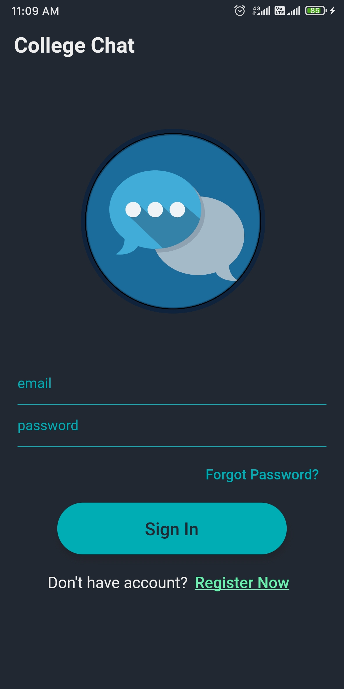
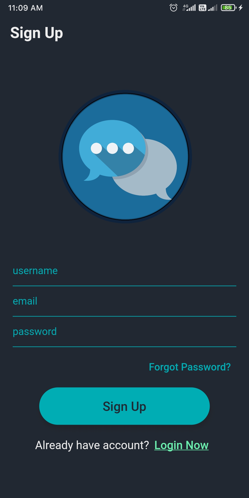
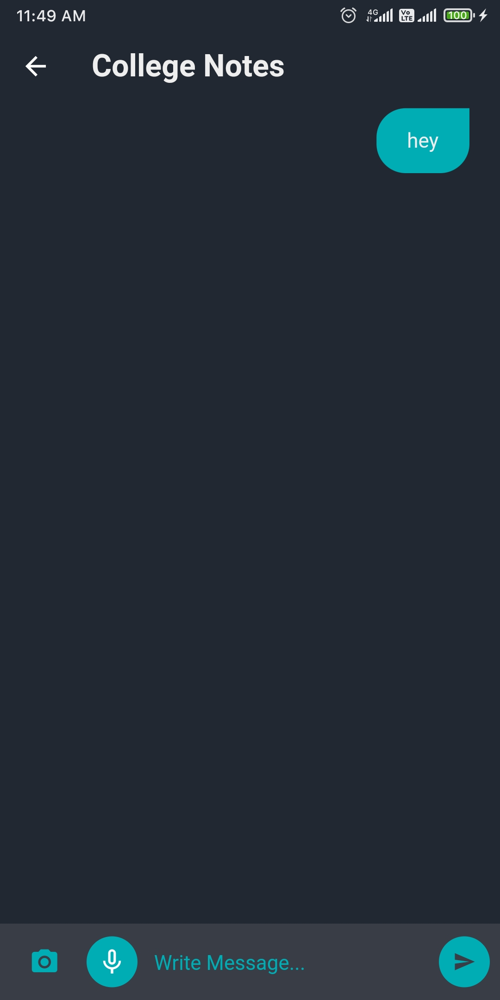
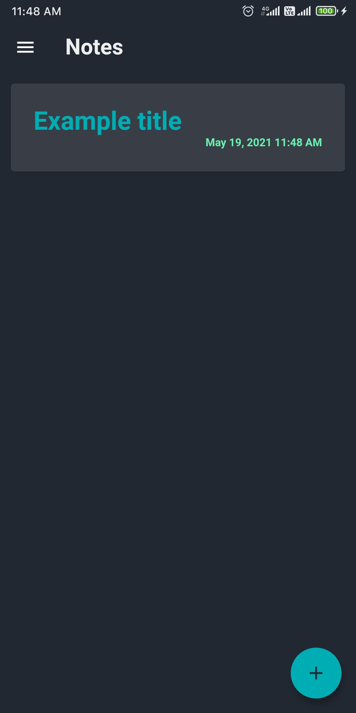
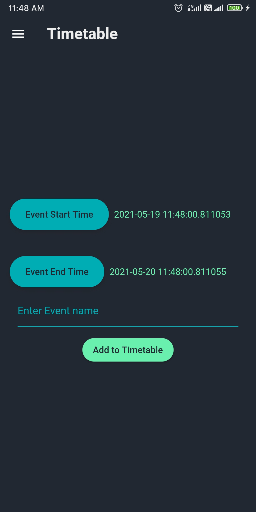

<!-- PROJECT LOGO -->
<br />
<p align="center">
  <a href="https://github.com/Glonk-0/college_chat">
    
  </a>
 <h3 align="center">College Chat</h3>

  <p align="center">A app which helps students to communicate with others
  <br />
    <a href="https://github.com/Glonk-0/college_chat"><strong>Explore the docs »</strong></a>
    <br />
    <br />
    <a href="https://github.com/Glonk-0/college_chat">View Demo</a>
    ·
    <a href="https://github.com/Glonk-0/college_chat/issues">Report Bug</a>
    ·
    <a href="https://github.com/Glonk-0/college_chat/issues">Request Feature</a>
  </p>
</p>
<!-- TABLE OF CONTENTS -->
<details open="open">
  <summary>Table of Contents</summary>
  <ol>
    <li>
      <a href="#about-the-project">About The Project</a>
      <ul>
        <li><a href="#built-with">Built With</a></li>
      </ul>
    </li>
    <li>
      <a href="#installation">Installation</a></li>
    </li>
    <li><a href="#contributing">Contributing</a></li>
    <li><a href="#contact">Contact</a></li>
  </ol>
</details>
<!-- ABOUT THE PROJECT -->

  ### About Project
  
 
  

  ### Chat  
Users can One-on-One chat, share images and use speech to text to write without a keyboard. 



  ### Notes  
Users can create and delete sticky notes.



  ### Timetable
Users can setup any reminders, events, multiple-day events using the timetable module.




  ### Built With

* [Flutter](https://flutter.dev/)
* [Dart](https://dart.dev/)
* [Firebase](https://firebase.google.com/)

### Installation

1.  Clone the repo in Android Studio
   ```sh
   git clone https://github.com/Glonk-0/college_chat.git
   ```
2. Install flutter dependencies
    * From the terminal: 
    ```sh
      Run flutter pub get
    ```
    *  From Android Studio/IntelliJ: Click Packages get in the action ribbon at the top of pubspec.yaml.
    *  From VS Code: Click Get Packages located in right side of the action ribbon at the top of pubspec.yaml.


<!-- CONTRIBUTING -->
## Contributing

Contributions are what make the open source community such an amazing place to be learn, inspire, and create. Any contributions you make are **greatly appreciated**.

1. Fork the Project
2. Create your Feature Branch (`git checkout -b feature/AmazingFeature`)
3. Commit your Changes (`git commit -m 'Add some AmazingFeature'`)
4. Push to the Branch (`git push origin feature/AmazingFeature`)
5. Open a Pull Request


<!-- CONTACT -->
## Contact
  This repository is owned and maintained by:
  
* [Sohail Alekar](https://github.com/Glonk-0)
* [Devansh Upadhyay](https://github.com/DevanshUpadhyay26)

Project Link: [https://github.com/Glonk-0/college_chat](https://github.com/Glonk-0/college_chat)

